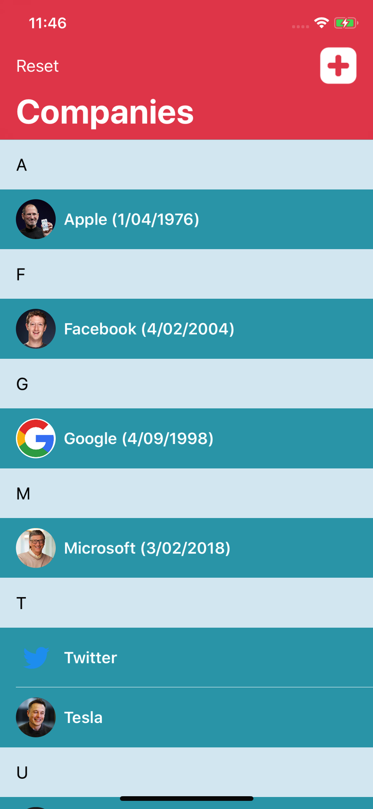
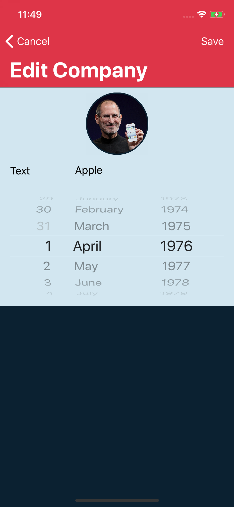

# Core Data of Swift 4

Following along with the online course at [LetsBuildThatApp](https://www.letsbuildthatapp.com/course/Intermediate-Training-Core-Data)
, the code is implemented by Swift 4 & Xcode 9.2.

## Screenshots
  &nbsp; &nbsp; 